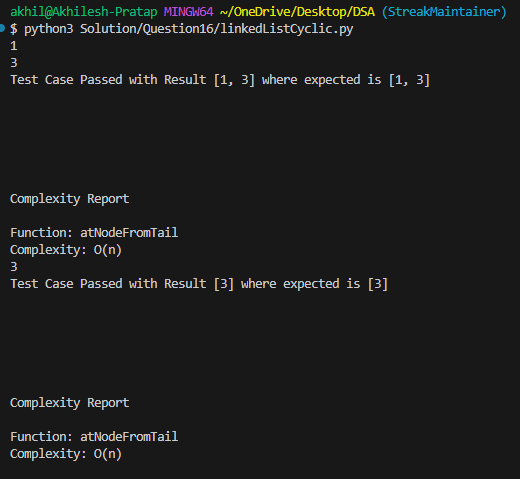

```
def atNodeFromTail(head,position):
    cur = head
    stack = []
    while cur != None:
        stack.append(cur.data)
        cur = cur.next
    return stack[-position-1]
```


Simple Solution with O(N) complexity